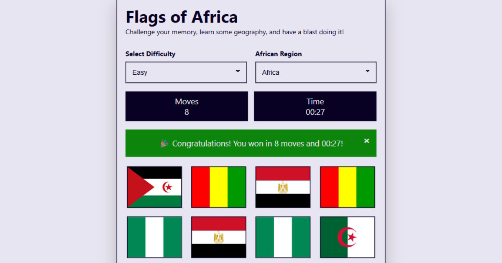

# 🌍 Flags of Africa Memory Game 🌍



## An exciting and educational journey into the heart of Africa!

Have you ever noticed the lack of fun, interactive, and educational content about Africa? This project was born out of a desire to change that! We believe in making learning about Africa's rich and diverse cultures an engaging experience for everyone.

This memory game is more than just a game; it's an adventure that will test your knowledge and teach you about the beautiful flags of the [55 African Nations](#countries-included). Get ready to challenge your memory, learn some geography, and have a blast doing it!

## ✨ Features & Tech Stack

-   🎮 **Interactive Gameplay:** A classic memory game with a modern twist.
-   🌐 **HTML5 & CSS3:** No bloated ~~CSS Frameworks~~ this is purely custom built with the latest web standards for a smooth and responsive experience.
-   💻 **JavaScript:** Powers the game's logic and interactivity.
-   🗂️ **JSON:** Manages the flag and country data for easy updates.

## 📚 Libraries & Frameworks

-   🚩 **Flag Icons:** A fantastic collection of SVG flags from [Flag Icons](https://flagicons.lipis.dev/).
-   💡 **Tippy.js:** For beautiful and accessible tooltips.

### 💻 Development Dependencies

To set up the development environment, you'll need to install the following dependencies:

-   **Sass:** A CSS pre-processor.
-   **Webpack:** A module bundler.
-   **Webpack-CLI:** Command line interface for Webpack.

You can install them using npm:

```bash
# Install development dependencies
npm install --save-dev sass webpack webpack-cli
```

Once installed, you can run the following commands to build the CSS and JavaScript:

```bash
# Build CSS
npm run css-build

# Build JavaScript
npm run js-build
```

## 🗺️ Countries Included

The countries and their flags are based on the official [Regions of the African Union](https://au.int/en/member_states/countryprofiles2). The African Union (AU) is made up of 55 Member States which represent all the countries on the African continent. AU Member States are divided into five geographic regions. which were defined by the Organization of African Unity (OAU) in 1976 (CM/Res.464QCXVI).

The OAU is the predecessor of the AU. The OAU was a continental body established in 1963 to promote unity and solidarity among African states and to coordinate cooperation for a better life for the people of Africa. The OAU was later replaced by the African Union (AU) in 2002. 

### North Africa
- Egypt (eg), Libya (ly), Tunisia (tn), Algeria (dz), Morocco (ma), Sudan (sd)

### Southern Africa
- South Africa (za), Zimbabwe (zw), Botswana (bw), Namibia (na), Zambia (zm), Lesotho (ls), Eswatini (sz), Malawi (mw)

### East Africa
- Kenya (ke), Ethiopia (et), Tanzania (tz), Uganda (ug), Rwanda (rw), Burundi (bi), Somalia (so), Djibouti (dj)

### West Africa
- Nigeria (ng), Ghana (gh), Senegal (sn), Mali (ml), Burkina Faso (bf), Ivory Coast (ci), Guinea (gn), Sierra Leone (sl), Liberia (lr), Togo (tg), Benin (bj)

### Central Africa
- Cameroon (cm), Chad (td), Central African Republic (cf), Gabon (ga), Equatorial Guinea (gq), Republic of Congo (cg), Democratic Republic of Congo (cd), Angola (ao)

---

## 📜 License

```
MIT License

Copyright (c) 2025 Hikwa Mehluli

Permission is hereby granted, free of charge, to any person obtaining a copy
of this software and associated documentation files (the "Software"), to deal
in the Software without restriction, including without limitation the rights
to use, copy, modify, merge, publish, distribute, sublicense, and/or sell
copies of the Software, and to permit persons to whom the Software is
furnished to do so, subject to the following conditions:

The above copyright notice and this permission notice shall be included in all
copies or substantial portions of the Software.

THE SOFTWARE IS PROVIDED "AS IS", WITHOUT WARRANTY OF ANY KIND, EXPRESS OR
IMPLIED, INCLUDING BUT NOT LIMITED TO THE WARRANTIES OF MERCHANTABILITY,
FITNESS FOR A PARTICULAR PURPOSE AND NONINFRINGEMENT. IN NO EVENT SHALL THE
AUTHORS OR COPYRIGHT HOLDERS BE LIABLE FOR ANY CLAIM, DAMAGES OR OTHER
LIABILITY, WHETHER IN AN ACTION OF CONTRACT, TORT OR OTHERWISE, ARISING FROM,
OUT OF OR IN CONNECTION WITH THE SOFTWARE OR THE USE OR OTHER DEALINGS IN THE
SOFTWARE.
```